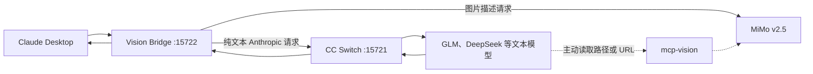

# CC Switch Vision Bridge

为 Claude Desktop 经由 CC Switch 使用的纯文本模型补充图片理解能力。

当用户直接粘贴图片，或 Playwright、Claude Preview 等工具返回截图时，本地代理会先调用 MiMo v2.5 生成描述，再把纯文本请求交给 CC Switch。AI 主动读取本地图片路径或 URL 时，继续使用 `mcp-vision`。

> Experimental / Beta。该项目不是 CC Switch、Anthropic、小米 MiMo 或 mcp-vision 的官方组件。

## 工作方式



两条链路分工如下：

| 场景 | 处理方式 |
|---|---|
| 聊天框粘贴或上传图片 | Vision Bridge 自动拦截 |
| Playwright、Claude Preview 等工具截图 | Vision Bridge 递归处理 `tool_result` |
| AI 主动读取本地文件路径 | `mcp-vision` |
| AI 主动分析图片 URL | `mcp-vision` |

## 支持范围

- Windows 10、Windows 11
- Python 3.11 或更高版本
- Claude Desktop 第三方 Gateway profile
- CC Switch 本地代理模式
- 小米 MiMo `/v1/chat/completions` 视觉 API
- PNG、JPEG、WebP、GIF

当前版本固定以 MiMo v2.5 作为视觉模型，文本主模型已使用 GLM 5.2 验证。

## 安装

先确认 CC Switch 本地代理正在 `127.0.0.1:15721` 运行，然后在 PowerShell 中执行：

```powershell
git clone https://github.com/YunjianAI/cc-switch-vision-bridge.git
cd cc-switch-vision-bridge
Set-ExecutionPolicy -Scope Process Bypass
.\install.ps1 `
  -VisionBaseUrl "https://api.xiaomimimo.com/v1"
```

安装器会安全提示输入 API Key。密钥存入 Windows Credential Manager，不写入 TOML、日志或仓库。

安装器会：

1. 创建 `%LOCALAPPDATA%\CCSwitchVisionBridge\.venv`。
2. 安装 Vision Bridge 和固定版本的 `mcp-vision`。
3. 备份选中的 Claude Desktop profile。
4. 只把 `inferenceGatewayBaseUrl` 改为 `http://127.0.0.1:15722/claude-desktop`。
5. 创建当前用户登录时自动启动的计划任务。
6. 生成 `%LOCALAPPDATA%\CCSwitchVisionBridge\mcp-config-snippet.json`。

如果需要自动合并 MCP 配置，显式提供配置文件路径：

```powershell
.\install.ps1 `
  -VisionBaseUrl "https://api.xiaomimimo.com/v1" `
  -ConfigureMcp `
  -McpConfigPath "D:\your-project\.claude\.mcp.json"
```

修改前会把完整 MCP 配置备份到 `%LOCALAPPDATA%\CCSwitchVisionBridge\backups`，避免把可能含旧密钥的备份留在项目目录。不提供 `-ConfigureMcp` 时不会修改任何 MCP 配置。

## 状态与卸载

```powershell
.\status.ps1
```

健康接口：

```text
http://127.0.0.1:15722/health
```

它只返回版本、上游连通性、视觉调用计数、缓存统计和 profile 守护状态。

卸载：

```powershell
.\uninstall.ps1
```

卸载器只停止命令行中包含 `cc_switch_vision_bridge` 的已记录 PID。如果 profile 仍由本项目接管，则恢复安装前地址；如果已经被其他程序修改，则不会覆盖。

## 配置

配置文件位于 `%LOCALAPPDATA%\CCSwitchVisionBridge\config.toml`。完整示例见 `config.example.toml`。

常用选项：

- `max_request_mb = 64`：代理允许读取的请求体上限。
- `max_upstream_mb = 32`：图像替换后允许发送到 CC Switch 的上限。
- `max_concurrency = 3`：并行视觉请求数量。
- `ttl_hours = 24`：缓存时间，设为 `0` 可关闭缓存。
- `guard_enabled = true`：CC Switch 重写 profile 后自动恢复 15722。

无人值守安装可在进程环境中临时设置 `CCSVB_VISION_API_KEY`。不要把它写入仓库或脚本。

## 失败处理

- 用户直接发送的图片识别失败时，请求返回 422 或 502，原图不会发送给文本模型。
- 工具结果里的截图识别失败时，图片会被替换成 `[Image Analysis Failed]`，主对话继续运行。
- 视觉模型的空结果、超时、HTTP 错误和安全拒绝不会进入缓存。

## 排错

- `vision_preprocessing_error: Vision provider timed out`：代理已收到图片，但视觉供应商没有在配置时间内响应。先直接测试视觉 API，再考虑增大 `timeout_seconds`。
- 工具任务继续运行但没有读懂截图：检查工具结果中是否出现 `[Image Analysis Failed]`，这是防止会话卡死的降级行为。
- `upstream_unreachable`：确认 CC Switch 本地代理正在配置的上游端口运行。
- 切换供应商后失效：运行 `status.ps1`，检查 `profile_guard.running` 和 `last_error`。
- `request_too_large_after_preprocessing`：历史文本或其他附件在移除图片后仍超过上游限制，应新建会话或移除大附件。

## 隐私与安全

- 服务只监听回环地址。
- 缓存不保存原图或 base64，只保存视觉描述和哈希。
- 日志不记录完整用户消息、API Key、请求正文或视觉 API 响应正文。
- 安装器不会读取或上传 Hermes 会话、Claude 对话或 CC Switch 数据库。
- 发送给视觉 API 的图片仍会离开本机，请按所用视觉服务商的隐私政策使用。

## 开发

```powershell
python -m venv .venv
.\.venv\Scripts\python.exe -m pip install -e ".[dev,mcp]"
.\.venv\Scripts\python.exe -m pytest -v
.\.venv\Scripts\python.exe -m ruff check .
```

## English summary

CC Switch Vision Bridge is a loopback-only image preprocessing proxy for Claude Desktop users who route requests through CC Switch to text-only models. It converts both user image blocks and images nested in tool results into text descriptions produced by an OpenAI-compatible vision model. Local paths and image URLs remain available through the optional `mcp-vision` integration.

## Acknowledgements

- [CC Switch](https://github.com/farion1231/cc-switch)
- [mcp-vision](https://github.com/hahahahanb/mcp-vision), used as an MIT-licensed dependency
- [Claudish](https://github.com/MadAppGang/claudish), an independent project with a related vision proxy design

## License

MIT
